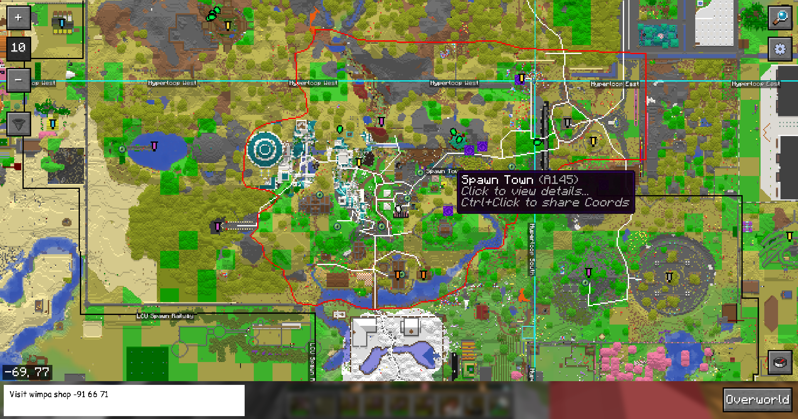
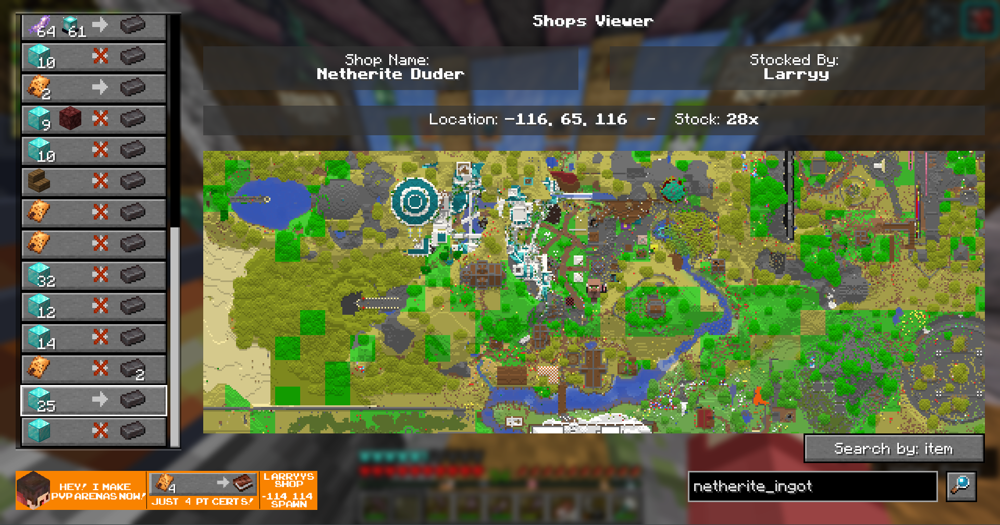

# PVC Mapper Mod
Minecraft mod adding interactive 2D map with PVC Mapper integration

## Things it does:
- Minimap + Full world map view from the online 2D map
- Shows other players from the online 2D map
- Shows places/areas/portals people have marked onto the Mapper site
- Shows claims on the map in-game
- Shows the sponsor banner things from both the Mapper and the PVC 2D map on the full-world map view
- Adds a client-side command to check if someone's AFK (and how long they have been)
- Adds a client-side command to search for things on the mapper (and copy details to clipboard)
- Adds a working GPS in game with line guides to find your way around the server

## Installing
- Grab the stable release `.jar` file from the PVC Mapper website:
https://pvc.coolwebsite.uk/mod

> [!CAUTION]
> The following builds may fail and crash your game! If you experience any bugs/crashes from these, try going back a build.
> While theses builds shouldn't™ corrupt your game, there is no guarantee. Use at your own risk ✨
- Find the latest test builds from the Github Actions output
    - Head to the actions page: https://github.com/LarryTLlama/pvc-mapper-mod/actions/
    - Click on the latest successful build (has a green check)
    - Scroll to the "Artifacts" section and download for your version
    - Unzip the .zip you download and move the .jar into your mods folder

## Reporting issues
- Open a new Github Issue (click the Issues tab). Include crash log details if applicable

## Screenshot Gallery
(Screenshots updated as of v1.4.1)

